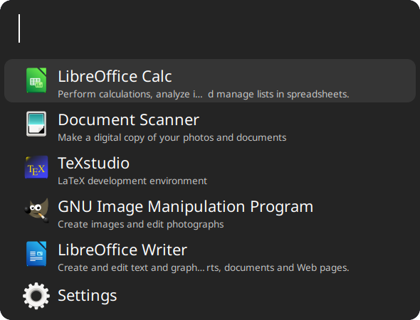

# `libadwaita-ulauncher`

A Ulauncher dark theme based on named colors of adwaita ([ADW](https://gnome.pages.gitlab.gnome.org/libadwaita/doc/1.2/named-colors.html#window-colors)) named colors.

## Credit

This theme is a fork of [kareemkasem's libadwaita dark theme for ulauncher](https://github.com/kareemkasem/ulauncher-theme-libadwaita-dark).

## Screenshots



## Installation

Run the following script in your terminal:

```bash
mkdir -p ~/.config/ulauncher/user-themes

git clone https://github.com/iaacornus/libadwaita-ulauncher ~/.config/ulauncher/user-themes/libadwaita-ulauncher
```
